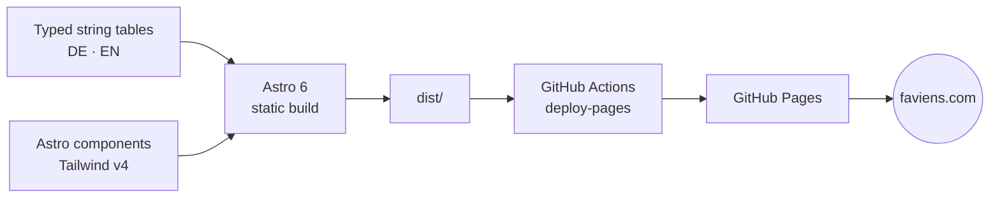

# Faviens

> Agentic-AI consulting in Zürich, Switzerland.
> Live at **[faviens.com](https://faviens.com)**.

[](https://github.com/faviens/faviens-website/actions)
[](https://faviens.com)
[](https://astro.build)
[](https://tailwindcss.com)
[](https://www.typescriptlang.org)

Static, bilingual (DE / EN) placeholder site. Zero JavaScript framework, self-hosted fonts, no third-party tracking. Built with Astro and Tailwind v4, deployed via GitHub Actions to GitHub Pages, served from a custom domain. Currently a single coming-soon page; the component and i18n scaffolding is in place to grow into the full site.

Implements the Faviens design handoff of 2026-08-08. See [Design system](#design-system) for which parts are settled and which are still provisional.

## Build pipeline



## Stack

| Layer           | Choice                                                              |
| --------------- | ------------------------------------------------------------------- |
| Framework       | [Astro 6](https://astro.build) (static output)                      |
| Styling         | [Tailwind CSS 4](https://tailwindcss.com) via `@tailwindcss/vite`   |
| Fonts           | Self-hosted Archivo Variable ([Fontsource](https://fontsource.org)) |
| i18n            | Astro built-in routing (DE default, EN at `/en/`)                   |
| Sitemap         | `@astrojs/sitemap` with hreflang alternates                         |
| OG image        | Build-time SVG → PNG via `sharp`                                    |
| Type checking   | TypeScript 5 (strict)                                               |
| CI              | GitHub Actions → [`deploy.yml`](.github/workflows/deploy.yml)       |
| Hosting         | GitHub Pages                                                        |
| Runtime (build) | Node 22.12+ (see [`.nvmrc`](.nvmrc))                                |
| Package manager | pnpm 9                                                              |

## Local development

```bash
pnpm install
git config core.hooksPath .githooks   # once per clone, arms the guards
pnpm dev                              # http://localhost:4321
```

Needs Node 22.12+. If you use nvm, `nvm use` picks it up from [`.nvmrc`](.nvmrc);
note that nvm is a shell function, so it only exists in shells that have sourced
`~/.nvm/nvm.sh`. Any Node 22.12+ on `PATH` works without it.

Other scripts:

```bash
pnpm check         # astro check + tsc strict
pnpm build         # produces ./dist
pnpm preview       # serves ./dist locally on :4321
pnpm format        # prettier --write .
pnpm verify        # the full gate, see below
```

## Quality gate

`pnpm verify` ([`scripts/verify.mjs`](scripts/verify.mjs), dependency-free) is
what CI runs and what blocks a merge. It checks the build and strict type-check,
prettier cleanliness, em-dashes, generic credential patterns, terms from a
local-only `.leakwords`, confidential paths that are tracked or staged, and
German/English parity. `pnpm verify --skip-build` is the fast variant.

Secret protection is layered, because on a public repository that deploys on
push, a secret caught after the push is already public:

| Layer                                          | What it does                                                                                                              |
| ---------------------------------------------- | ------------------------------------------------------------------------------------------------------------------------- |
| [`.githooks/pre-commit`](.githooks/pre-commit) | Blocks local-only paths and runs `gitleaks git --staged`. Needs `brew install gitleaks`; degrades to a warning without it |
| [`.githooks/commit-msg`](.githooks/commit-msg) | Blocks commit messages naming a term from `.leakwords`                                                                    |
| [`verify.yml`](.github/workflows/verify.yml)   | `gitleaks` over the **full history** on every PR, plus `pnpm verify`                                                      |
| [`deploy.yml`](.github/workflows/deploy.yml)   | `pnpm verify` again on the deploy path                                                                                    |

`git config core.hooksPath .githooks` is per clone and is not carried in the
repository, so a fresh clone is unprotected until it is run.

See [AGENTS.md](./AGENTS.md) for the full working conventions.

## Environment

Copy [`.env.example`](.env.example) to `.env.local` for local overrides. Production values are injected by GitHub Actions; the only required runtime variable is `SITE_URL` (set in the workflow). `CONTACT_EMAIL` falls back to the address in [`src/data/company.ts`](src/data/company.ts), which is the one place it is defined.

## Project layout

```
public/               static assets (mark.svg, mark-dot.svg, robots, llms.txt, CNAME)
src/
  pages/              .astro routes (DE at /, EN at /en/)
  layouts/            BaseLayout
  components/         Hero, Header, Footer, ContactCTA, GlobeField, ...
  components/marks/   MarkGlobe, MarkWordmark, MarkLockup
  lib/globe.mjs       the mark's geometry (mt19937.mjs under it)
  i18n/               typed string tables (de.ts, en.ts)
  styles/global.css   Tailwind v4 @theme tokens
scripts/              build-time helpers (raster asset generation via sharp)
scripts/assets/       token-templated SVG sources for the icons and OG image
scripts/check-globe.mjs  asserts the generated mark against the artwork of record
.github/workflows/    CI definition
```

## Design system

Source: **Faviens Design Handoff, 2026-08-08**.

### Settled

| Area     | Decision                                                                                                                                                                               |
| -------- | -------------------------------------------------------------------------------------------------------------------------------------------------------------------------------------- |
| Palette  | `--color-paper` `#FDFDFB`, `--color-ink` `#0E0E10`, `--color-grey` `#71716E`, `--color-hair` `#E4E3DE`, accent `#FF000D` / `#D6000B` / `#FF6B73`, tonal ramp `--color-t0`–`--color-t5` |
| Typeface | Archivo, single family. Hierarchy from size, weight and colour only. Never add a second family                                                                                         |
| Layout   | Zürich modernist: strict grid, hairline rules, numbered sections in a 2.5rem left column, copy at 58ch, one accent event per screen                                                    |

Token names match the handoff one-to-one, with two exceptions. The handoff's `--black` is `--color-ink` so it does not clobber Tailwind's built-in black, and its `gold` is `accent`: the palette is under review, and a token named for a colour becomes a lie the moment that colour changes.

**Every colour in the repository is stated once**, in the `:root` block at the top of `src/styles/global.css`, as an rgb triplet. A triplet is the only form that can also carry an alpha, which is what lets a keyframe write `rgb(var(--rgb-accent) / 0.35)` and the globe field compose an alpha per depth layer per frame without restating anything. `@theme` turns the triplets into the colours Tailwind generates utilities from.

Two contexts cannot resolve a CSS custom property: the `theme-color` meta tag, which takes a literal, and the standalone SVGs behind the icons and the link preview, which have no page to inherit from. Both read the tokens instead of repeating them. `BaseHead.astro` imports the stylesheet a second time with Vite's `?raw` and parses it; the marks, icons and link preview are **generated** from `src/lib/globe.mjs` and the templates in `scripts/assets/` by `scripts/generate-og.mjs`, which runs on `predev` and `prebuild` and throws if a template names a token or a mark variant that does not exist.

Changing the palette is therefore the ten accent and ramp lines in `global.css`, and nothing else. Verified by swapping the whole family and reverting: the mark, the status marker, the labels, the globe field, the favicon and the OG image all followed.

One contrast rule is load-bearing and enforced in the components. The accent measures **3.9:1** on paper, which passes for large text and fails for normal text, so it is never used for running text or for type below the large-text threshold. `--color-accent-d` is **5.3:1** and covers small type: the eyebrows, the language switcher and the services prefix below `md` all use it.

### Draft in review, not final

As of 2026-08-17 the site runs a **draft** identity: a red accent family in place of the handoff's gold, and FAVIENS in capitals with the A and the I in the accent. The globe joined it on 2026-09-04, from a brand package delivered outside this repository. Neither has been through an identity review. The gold palette and the tittle mark it replaced are in git history, and reverting the palette is the ten accent and ramp triplets in `global.css`.

Only the chosen direction is in the tree. The candidates it beat, the sheets they came from and the harness that compared them are deliberately not here: the repository carries what the site uses.

The logo is the **horizontal lockup**: a wound-string globe on the left, the wordmark on the right. The wordmark is **FAV, a red bar, ENS**, capitals set in ink with the bar standing in for the I as the mark's only accent event. See [`MarkLockup.astro`](src/components/marks/MarkLockup.astro), [`MarkGlobe.astro`](src/components/marks/MarkGlobe.astro) and [`MarkWordmark.astro`](src/components/marks/MarkWordmark.astro).

The capitals are `text-transform`, not typed, and the `i` is still in the text behind the bar. The page text stays "faviens", so the site is never quoted back as "FAVIENS" or, worse, as "favens".

### The globe

Sixty strands, each a real circle lying on a sphere and projected orthographically. The crossings, the bunching at the silhouette and the roundness fall out of the 3D geometry; 2D noise does not give the same silhouette.

It is generated rather than pasted in, by [`src/lib/globe.mjs`](src/lib/globe.mjs), because the background has to turn the sphere and a flattened SVG has no depth left to turn. [`src/lib/mt19937.mjs`](src/lib/mt19937.mjs) reproduces CPython's Mersenne Twister exactly, so seed 7714 draws the same sixty strands here as it did in the brand package's Python build: `scripts/check-globe.mjs` digests the output and compares it against the committed `faviens-circle.svg`, which it matches byte for byte. `pnpm verify` runs that check, and the committed artwork wins over the generator.

The real mark holds down to about **28px**. Below that the strands fall under a pixel and it rasterises as a soft disc, so there are two drawings: `full` wherever the mark is a logo, which is everywhere above 28px including the favicon from 32px up, and `dot` (the first eight strands of the same sequence, thicker-stroked and on the flat accent) for the 13 to 20px band where bullets live. That floor is why the header wordmark is set at 30px, which is what puts the globe beside it at 28px. `public/mark.svg` and `mark-dot.svg` are the two, written at `predev` and `prebuild`.

The wordmark is **FAV, a red bar, ENS**: the bar stands in for the I at 0.42 of its stem width and is the mark's only accent event. The `i` stays in the text, visually hidden, so the name still extracts and reads as "faviens". The bar is an SVG rect rather than a coloured box, because a background colour is painted onto whole device pixels and the bar's width came out 8% over in the header and under 1% in the hero, which is visible when both are on screen.

Icons are PNGs and there is deliberately no SVG favicon: a browser offered one prefers it and then rasterises sixty hairline strands however it likes, which comes out a soft disc. The 32 and 48px icons are drawn here with the strokes inked up for the raster; 180 and 512 use the logo untouched. There is no 16px icon, because nothing legible as this mark exists at 16px.

The lockup's numbers are the brand package's: diameter 1.34 cap heights, gap 0.35, circle centred on the **cap midline** and not on the type's box, which is what stops it reading as hanging. The bar is centred on that same line and is exactly as tall as the circle is wide, which is a deliberate departure: the package gives the bar a real pipe glyph's asymmetric overshoot, and beside the circle the two then disagree. Archivo 800's cap is 0.68709em and its I stem 0.179469em, both measured in a browser and stated once in `src/lib/type.mjs`.

### The globe field

[`src/components/GlobeField.astro`](src/components/GlobeField.astro) draws the moving background: the same mark, a little larger than the viewport's shorter side, turning once every 150 seconds. Canvas, no dependencies. It replaces the node field, which was an exception to the ban on network decoration; the background is now the identity itself, so the exception is gone and the ban stands as written.

Two modes. `draw` lays the strands down one after another as the sphere turns and then keeps turning, so the mark builds itself once per visit; `rotate` is already turning when the page opens. `draw` is the default, and `BaseLayout` takes `backgroundMode` to switch it.

The projection is recomputed every frame rather than an image being spun: the strands cross differently at every angle, which is what a real sphere does and what the eye reads as one. Strands are batched into three paths by depth, so a frame is three strokes. A radial mask holds the field back over the band the lockup and the lead sit in, at 0.45 rather than 0, because a hole punched in the sphere reads worse than the crossings did.

The three depth colours come from `--globe-back`, `--globe-mid` and `--globe-front` in `global.css`, so an accent change moves the field with it. There is no fallback colour in the component: a fallback would be the one place a palette value is written twice.

`BaseLayout` takes `background="off" | "quiet" | "active"` and defaults to `quiet`; the legal pages pass `off`. Under `prefers-reduced-motion` it paints one static frame and never starts the loop, and it stops entirely when the tab is hidden or it scrolls out of view.

### Still open

The name has **not been legally cleared** (Zefix, Swissreg classes 9/35/42, TMview, WIPO). The imprint and privacy pages do not exist yet. `Header` and `Footer` accept `navLinks` / `legalLinks` and render those blocks only when non-empty.

## Deployment

`main` is the deploy branch. Every push triggers [`deploy.yml`](.github/workflows/deploy.yml):

1. Install dependencies (pnpm, frozen lockfile)
2. `pnpm verify`, which runs `astro check && astro build`
3. Upload `dist/` as a Pages artifact
4. Publish via `actions/deploy-pages`
5. `smoke`: wait for the live domain to serve this run's commit, then check the real pages

The artifact contains `public/CNAME`, which keeps `faviens.com` wired to the deployment across runs.

The `smoke` job stays red until the DNS records below and the Pages custom domain are in place. That is the intended signal: it is the check that tells you the domain work is finished.

### DNS

`faviens.com` is registered at GoDaddy and points at GitHub Pages:

| Type  | Name  | Value                                                                                      |
| ----- | ----- | ------------------------------------------------------------------------------------------ |
| A     | `@`   | `185.199.108.153`, `185.199.109.153`, `185.199.110.153`, `185.199.111.153`                 |
| AAAA  | `@`   | `2606:50c0:8000::153`, `2606:50c0:8001::153`, `2606:50c0:8002::153`, `2606:50c0:8003::153` |
| CNAME | `www` | `faviens.github.io`                                                                        |

`faviens.ch` and `faviens.de` are 301-forwarded to `https://faviens.com` via GoDaddy domain forwarding (no masking). GitHub Pages supports only one custom domain per repository.

## SEO and LLM indexing

- JSON-LD `ProfessionalService` schema on every page
- Sitemap with hreflang alternates (`@astrojs/sitemap`)
- [`public/robots.txt`](public/robots.txt) explicitly allowlists major AI crawlers (Anthropic, OpenAI, Perplexity, Google-Extended, etc.)
- [`public/llms.txt`](public/llms.txt) for LLM-friendly site indexing

## License

Copyright © 2026 Daniel Vogler / FAVIENS. All rights reserved. See [`LICENSE`](./LICENSE).

Source is published for transparency. No usage, redistribution, or derivative-work rights are granted without explicit written permission.
