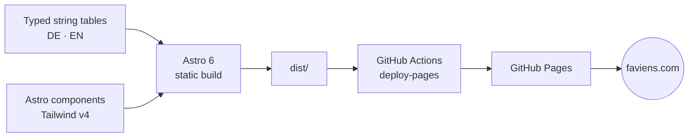

# FAVIENS

> Swiss consulting for AI, agentic AI, analytics, and data.
> Live at **[faviens.com](https://faviens.com)**.

[](https://github.com/danielvogler/faviens-website/actions)
[](https://faviens.com)
[](https://astro.build)
[](https://tailwindcss.com)
[](https://www.typescriptlang.org)

Static, bilingual (DE / EN) placeholder site. Zero JavaScript framework, self-hosted fonts, no third-party tracking. Built with Astro and Tailwind v4, deployed via GitHub Actions to GitHub Pages, served from a custom domain. Currently a single coming-soon page; the component and i18n scaffolding is in place to grow into the full site.

## Build pipeline



## Stack

| Layer           | Choice                                                            |
| --------------- | ----------------------------------------------------------------- |
| Framework       | [Astro 6](https://astro.build) (static output)                    |
| Styling         | [Tailwind CSS 4](https://tailwindcss.com) via `@tailwindcss/vite` |
| Fonts           | Self-hosted Inter Variable ([Fontsource](https://fontsource.org)) |
| i18n            | Astro built-in routing (DE default, EN at `/en/`)                 |
| Sitemap         | `@astrojs/sitemap` with hreflang alternates                       |
| OG image        | Build-time SVG → PNG via `sharp`                                  |
| Type checking   | TypeScript 5 (strict)                                             |
| CI              | GitHub Actions → [`deploy.yml`](.github/workflows/deploy.yml)     |
| Hosting         | GitHub Pages                                                      |
| Runtime (build) | Node 22.12+ (see [`.nvmrc`](.nvmrc))                              |
| Package manager | pnpm 9                                                            |

## Local development

```bash
nvm use            # Node 22.12+ from .nvmrc
pnpm install
pnpm dev           # http://localhost:4321
```

Other scripts:

```bash
pnpm check         # astro check + tsc strict
pnpm build         # produces ./dist
pnpm preview       # serves ./dist locally on :4321
pnpm format        # prettier --write .
```

## Environment

Copy [`.env.example`](.env.example) to `.env.local` for local overrides. Production values are injected by GitHub Actions; the only required runtime variable is `SITE_URL` (set in the workflow). `CONTACT_EMAIL` falls back to `hello@faviens.com` if not set.

## Project layout

```
public/               static assets (favicon, og.svg, robots, llms.txt, CNAME)
src/
  pages/              .astro routes (DE at /, EN at /en/)
  layouts/            BaseLayout
  components/         Hero, Header, Footer, ContactCTA, Section, ...
  i18n/               typed string tables (de.ts, en.ts)
  styles/global.css   Tailwind v4 @theme tokens + accent palette
scripts/              build-time helpers (OG image generation via sharp)
.github/workflows/    CI definition
```

## Deployment

`main` is the deploy branch. Every push triggers [`deploy.yml`](.github/workflows/deploy.yml):

1. Install dependencies (pnpm, frozen lockfile)
2. `astro check && astro build`
3. Upload `dist/` as a Pages artifact
4. Publish via `actions/deploy-pages`

The artifact contains `public/CNAME`, which keeps `faviens.com` wired to the deployment across runs.

### DNS

`faviens.com` is registered at GoDaddy and points at GitHub Pages:

| Type  | Name  | Value                                                                                      |
| ----- | ----- | ------------------------------------------------------------------------------------------ |
| A     | `@`   | `185.199.108.153`, `185.199.109.153`, `185.199.110.153`, `185.199.111.153`                 |
| AAAA  | `@`   | `2606:50c0:8000::153`, `2606:50c0:8001::153`, `2606:50c0:8002::153`, `2606:50c0:8003::153` |
| CNAME | `www` | `danielvogler.github.io`                                                                   |

`faviens.ch` and `faviens.de` are 301-forwarded to `https://faviens.com` via GoDaddy domain forwarding (no masking) — GitHub Pages supports only one custom domain per repository.

## SEO and LLM indexing

- JSON-LD `ProfessionalService` schema on every page
- Sitemap with hreflang alternates (`@astrojs/sitemap`)
- [`public/robots.txt`](public/robots.txt) explicitly allowlists major AI crawlers (Anthropic, OpenAI, Perplexity, Google-Extended, etc.)
- [`public/llms.txt`](public/llms.txt) for LLM-friendly site indexing

## License

Copyright © 2026 Daniel Vogler / FAVIENS. All rights reserved. See [`LICENSE`](./LICENSE).

Source is published for transparency. No usage, redistribution, or derivative-work rights are granted without explicit written permission.
